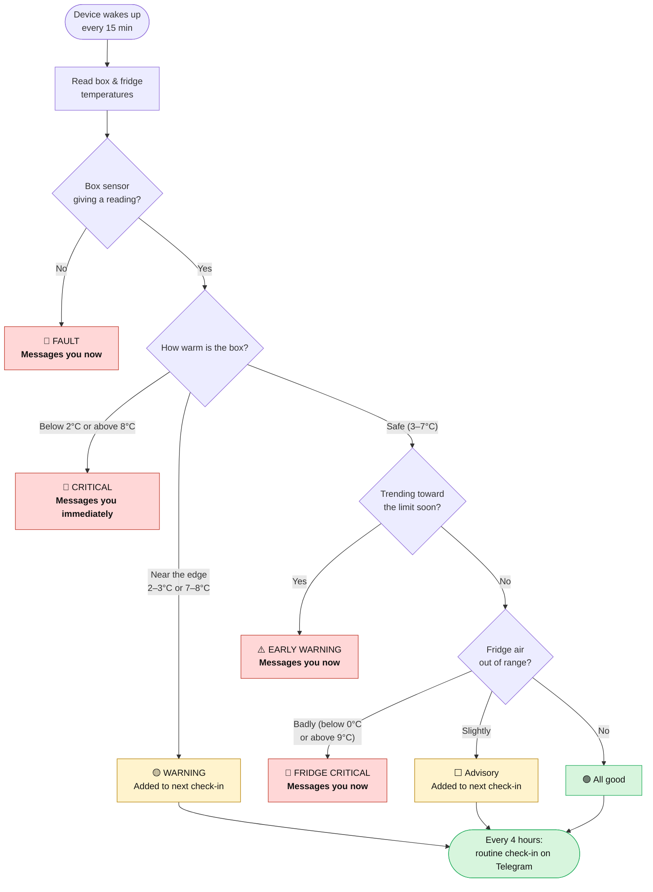
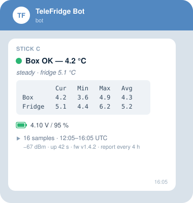
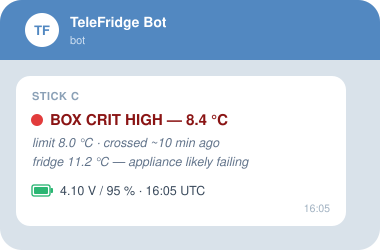

<picture>
  <source media="(prefers-color-scheme: dark)" srcset="./docs/img/logo-dark.svg">
  
</picture>

# TeleFridge

**A tiny, battery-powered gadget that watches your fridge and messages you on
Telegram if your insulin gets too warm or too cold.**

---

## ⚠️ Please read first

TeleFridge is a **hobbyist, do-it-yourself project**. It is **not a medical
device**, is not certified for medical use, and its alerts are *best effort* —
they can be delayed, or fail to send, because of weak Wi-Fi, a dead battery, or a
bug. **Never make it the only thing protecting your insulin (or any medication,
vaccine, or sample).** Always keep a proper, independent safeguard as well, and
treat anything TeleFridge tells you as helpful information, not a guarantee.

See [`DISCLAIMER.md`](./DISCLAIMER.md) for the full details.

---

## What it does

- 🌡️ Sits in your fridge and checks the temperature every 15 minutes (or as set by the user).
- 💬 Sends you a tidy status message on Telegram every few hours (also set by the user).
- 🚨 Warns you **right away** if things head out of the safe **2–8 °C** range.
- 🔋 Runs on its own small rechargeable battery and tells you when to charge it.
- 🔘 **Press the button** on the side any time you walk past: the little screen
  lights up for 3 seconds with the current status, and it sends you a report
  straight away.

## How the alerting works

TeleFridge puts your insulin in a small **insulated box** inside the fridge, and
watches it with two temperature sensors: one **inside the box** (the reading that
actually matters) and one in the **fridge air** around it (to spot trouble — a
door left open, a failing fridge — before it reaches the box).

Each time it wakes up, it decides what to do:

In short: a real problem — the box too warm or too cold, a broken sensor, or the
fridge itself failing — **messages you immediately**; smaller things (a gentle
drift toward the edge) simply **ride along in the next routine check-in**. It even
watches the trend, so a slow failure gets an **early heads-up before** your insulin
is actually out of range. It also sends a **low-battery warning** so it never goes
quiet without telling you first.

Only the *box* nags: while the box stays critical it keeps reminding you. A fridge
problem speaks once, so a noisy appliance can't drown out the reading that matters.

> ⚠️ The "early warning" prediction ships **uncalibrated**. It estimates how fast
> your box warms up using a constant (`TAU_BOX_MIN`) that has to be measured
> against *your* box; until you do, treat its timings as a rough hint, not a
> countdown. The immediate 2–8 °C alerts don't depend on it.

*(The physics and fine-tuning behind the "early warning" live in
[`CLAUDE.md`](./CLAUDE.md) for the curious.)*

## Telegram is the whole interface

- 📱 **No app to install, no extra account beyond Telegram, no website or server
  to run, and no piles of data to manage.** TeleFridge talks to you entirely through
  [Telegram](https://telegram.org), a free chat app you may already use.
- ⚙️ **You control it by messaging it back.** Want a different safe range, or
  limits tuned to your fridge? Send it a short message — no cable, no computer, no
  re-flashing.

### Commands you can send it

Just type these into the chat. Anything you send is checked for safety first, so a
silly value is politely refused rather than accepted.

| Command | What it does |
| --- | --- |
| `/status` | Show the current limits and settings |
| `/help` | List all the commands |
| `/defaults` | Put every setting back to the factory values |
| `/setbox <cold> <cool> <warm> <hot>` | Set the four **box** limits in °C (e.g. `2 3 7 8`) — the safe range for your insulin |
| `/setfridge <cold> <cool> <warm> <hot>` | Set the four **fridge-air** limits in °C (the early-warning band) |
| `/setbox <name> <value>` | Change one box limit on its own — `crit_low`, `warn_low`, `warn_high` or `crit_high` (e.g. `/setbox crit_high 8.5`). Works for `/setfridge` too |
| `/setreport <1–32>` | How many readings per check-in (16 = a report every 4 hours) |
| `/setinterval <1–60>` | Minutes between readings (default 15) |
| `/setholdoff <0–1440>` | Minutes between repeat reminders while still in a critical alert (0 = remind once) |
| `/setdebounce <1–8>` | How many readings in a row must be out of range before it alerts (1 = alert instantly) |

> ⏱️ A command takes effect at the **next check-in** (up to 4 hours away), or almost
> immediately if you send it as a reply to a critical alert. The box's core safe
> range is anchored to the medical **2–8 °C** window and is guarded so it can't be
> loosened by accident.

## What you'll see

A tidy status message every few hours, and an immediate message if something is
wrong. *(Illustrative mockups — real photos coming soon.)*

**Routine check-in (every 4 hours):**

**A critical alert (sent the moment it happens):**

**On the device itself:** the screen stays off to save battery. Press the button
and it wakes for 3 seconds, showing the verdict (colour-coded the same way as the
messages), both temperatures and the battery — then goes dark again and sends you
a report. A button press is designed to be the *only* thing that lights it: the
routine 15-minute and 4-hour wake-ups are meant to stay dark.

> 🔬 The "dark on every routine wake" behaviour is confirmed by design and by the
> project's own tests, but **has not yet been signed off on real hardware over a
> full day** (see the TFT bring-up checklist in [`CLAUDE.md`](./CLAUDE.md)). If
> you find the screen lighting up on its own, that's a bug worth reporting — and
> it will cost you battery life.

## What you need

- An **[M5StickC](https://docs.m5stack.com/en/core/m5stickc)** — the little
  computer with the battery and screen.
- An **[M5 ENV II Unit](https://docs.m5stack.com/en/unit/envII)** — the sensor
  that goes inside the insulated box.
- An **[M5 ENV HAT](https://docs.m5stack.com/en/hat/hat-env)** — the sensor that
  reads the fridge air.
- A **[Telegram](https://telegram.org) account** and a free Telegram bot.
- A small insulated box for your insulin, and a USB-C cable to charge and set up.

## Getting started

1. **Install [ESPHome](https://esphome.io/guides/getting_started_command_line)** —
   the free tool used to load the software onto the device.
2. **Create your Telegram bot** — in Telegram, message
   **[@BotFather](https://t.me/botfather)**, send `/newbot`, and follow the prompts
   to get your **bot token**. Then message
   **[@userinfobot](https://t.me/userinfobot)** to get your **chat ID** (the number
   that tells the bot who to message). Full walkthrough:
   [How do I create a bot?](https://core.telegram.org/bots#how-do-i-create-a-bot)
3. **Add your details** — copy `secrets.yaml.example` to `secrets.yaml` and fill in
   **all six** values, or the build will stop with a missing-secret error:
   - `wifi_ssid` and `wifi_password` — your Wi-Fi network.
   - `wifi_ssid_2` — a second network to fall back to. If you only have one, just
     put the same name as `wifi_ssid` here. (Both networks use `wifi_password`.)
   - `telegram_bot_token` and `telegram_chat_id` — from step 2.
   - `ota_password` — protects wireless updates. **Generate a strong random one**
     with `openssl rand -hex 16` — don't pick something memorable. Holding the
     reset button through ~10 restarts puts the device into safe mode, where it
     stays awake with Wi-Fi on and listens for an update; this password is the
     only thing guarding that.

   This file stays on your computer and is never shared — it is already listed in
   `.gitignore`.

   > 🔐 **Keep your bot token to yourself.** It is the key to your bot: anyone who
   > has it can message you *as* TeleFridge, including a fake "all clear". It also
   > shows up inside web addresses in the device's logs, so **redact any log
   > before pasting it into an issue or a forum.**
   > [`SECURITY.md`](./SECURITY.md) explains what to look for and how to get a new
   > token if the old one ever gets out.
4. **Flash it** — connect the M5StickC over USB-C and install `telefridge.yaml`
   with ESPHome. You should get a "hello" message on Telegram.
5. **Place it** — put the box sensor inside your insulated box, the box in the
   fridge, and let TeleFridge start its check-ins.

## This is V1 — a bigger, simpler V2 is coming

TeleFridge V1 is an early, hobbyist build, and it has real limitations: it takes
some technical setup to get going, runs for days (not weeks) on a charge, and
reports in plain text. It works — but it asks something of you.

**V2 is already planned, and aims to be far easier and more capable:**

- 🙌 **No technical skills required** — a simple, guided setup anyone can follow.
- 📦 **Easy-to-source hardware** — off-the-shelf parts you can buy anywhere.
- 🔋 **Long battery life** — lasting far longer between charges.
- 📈 **Graphs** — see the temperature history at a glance, not just numbers.
- ☁️ **Post to a remote server** and to **[Home Assistant](https://www.home-assistant.io)**,
  for long-term logging and home automation.
- 🧊 **Designed around an insulated box** — more thermal protection, so your
  payload stays safe for longer during a power outage.

*(V1 will stay here as the open-source starting point.)*

## Built on ESPHome

TeleFridge is built on **[ESPHome](https://esphome.io) (version 2026.4.5)**, a
free, open-source, and widely used platform for little Wi-Fi gadgets like this
one. Choosing it means the fiddly plumbing — Wi-Fi, deep-sleep battery saving,
reading the sensors, secure messaging, and updates — is handled by well-tested,
community-maintained code, so the project can focus on the part that matters:
keeping your insulin safe. It also keeps the whole setup **readable and
tweakable** — the configuration is a plain text file, not a locked-down black box —
so anyone can see exactly what the device does and adjust it to their own fridge.

## Security

The device holds your Wi-Fi details and your Telegram bot token, and there is one
leak that catches people out — **your bot token appears inside web addresses in
the device's logs**, so a log pasted into an issue can hand it to a stranger.
[`SECURITY.md`](./SECURITY.md) explains what to redact, how to get a fresh token
from BotFather if one gets out, and how to report a problem privately.

## Contributing

Improvements are welcome — see [`CONTRIBUTING.md`](./CONTRIBUTING.md). One rule
worth knowing up front: the **2–8 °C box limits are the medical compliance line
and are locked**, so a change that loosens them needs a documented argument, not
just a patch.

## License

Copyright © 2026 Insulin Guy and the TeleFridge contributors.

Free and open source under **[GPL-3.0-or-later](./LICENSE)**. A hobbyist project,
provided with **no warranty** — please read the [`DISCLAIMER.md`](./DISCLAIMER.md)
before you rely on it for anything.
